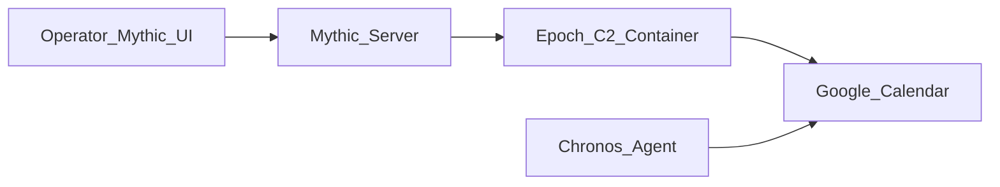

# Mythic Epoch + Chronos

  

Google Calendar dead-drop command and control for the [Mythic](https://github.com/its-a-feature/Mythic) framework.

| Component | Role |
|-----------|------|
| **Epoch** | Mythic **C2 profile** (Docker relay). Shuttles encrypted blobs between Mythic and Google Calendar. Never decrypts. |
| **Chronos** | Mythic **agent** (Python payload). Polls Calendar for tasking, runs commands, returns results via calendar events. |

> **Authorized use only.** Research and authorized red-team training only. Use on systems and accounts you own or have explicit permission to test.

**Start here:** [docs/SETUP.md](docs/SETUP.md) · **Stuck?** [docs/TROUBLESHOOTING.md](docs/TROUBLESHOOTING.md)

**Success** = Chronos callback in Mythic + one command (e.g. `whoami`) returns output.

---

## Architecture (Protocol V2)

- Routing metadata lives in calendar event `extendedProperties.private` (`agent_id`, `msg_type`, `proto_version`, `message_id`).
- Payload data lives in the event `description` (base64).
- Mythic encrypts end-to-end (`mythic_encrypts = True`). Epoch is a transparent shuttle over HTTPS to `googleapis.com`.

---

## License

MIT — see [LICENSE](LICENSE).
