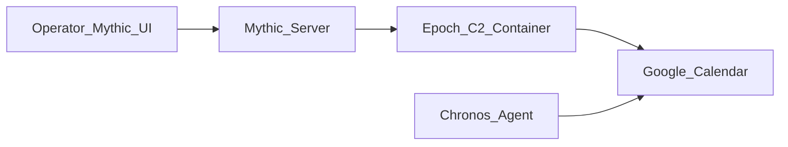

# Mythic Epoch + Chronos

  

Google Calendar dead-drop command and control for the [Mythic](https://github.com/its-a-feature/Mythic) framework.

**Repository:** https://github.com/0xNirvana/mythic-epoch-chronos

| Component | Role |
|-----------|------|
| **Epoch** | Mythic **C2 profile** (Docker relay). Shuttles encrypted blobs between Mythic and Google Calendar. Never decrypts. |
| **Chronos** | Mythic **agent** (Python payload). Polls Calendar for tasking, runs commands, returns results via calendar events. |

> **Authorized use only.** Research and authorized red-team training only. Use on systems and accounts you own or have explicit permission to test.

**Start here:** [docs/SETUP.md](docs/SETUP.md) · **Stuck?** [docs/TROUBLESHOOTING.md](docs/TROUBLESHOOTING.md)

**Success** = Chronos callback in Mythic + one command (e.g. `whoami`) returns output.

---

## Architecture (Protocol V2)

Google Calendar is the dead-drop hub — no direct agent-to-operator connection. Both sides talk to `googleapis.com` only.

- **Routing** — calendar event `extendedProperties.private` (`agent_id`, `msg_type`, `proto_version`, `message_id`)
- **Payload** — event `description` (and overflow fields when chunked), base64 on the wire
- **Crypto** — Mythic AES-256-CBC + HMAC in Chronos; base64 is encoding, not encryption. Epoch never decrypts.
- **Multi-agent** — one shared calendar; routing by `agent_id` (Mythic callback UUID)

### Message types

| `msg_type` | Direction | Meaning |
|------------|-----------|---------|
| `checkin` | Chronos → Epoch | Agent registers; Mythic assigns callback |
| `tasking` | Chronos → Epoch | Agent asks for work |
| `cmd` | Epoch → Chronos | Mythic tasking / replies (agent polls for these) |
| `resp` | Chronos → Epoch | Command output back to Mythic |

---

## Honest constraints

- **Latency** — ~30–120s round-trip depending on poll interval; not HTTP-snappy
- **Files** — ~500 KB practical cap, single-shot transfer
- **Scale** — ~10–20 agents per shared calendar before API quota gets tight
- **First check-in** — can take up to ~4 minutes in worst-case Calendar visibility lag

This is a command channel, not an interactive shell or bulk exfil pipe.

---

## When to use (and when not to)

**Use it when**

- Primary beacon burned — need a lifeline without new attacker infra
- Re-entry, liveness checks, light async tasking
- Low-and-slow work batched into poll windows (recon, staging)
- Long dwell with minimal sustained noise

**Skip it when**

- Sub-second interactive shells
- Large file exfil
- No Google / locked-down Workspace API path
- Time-sensitive tasks where plain HTTP may be faster and quieter

Epoch is to Calendar what an HTTP profile is to HTTP — a transport layer. Complements HTTP/DNS C2; does not replace them.

---

## Detection (awareness)

Not undetectable. Defenders who instrument the right place can see it:

- Google Workspace / Calendar **API audit logs** (often unmonitored)
- Rapid create/delete event churn
- Heavy `extendedProperties.private` usage (rare for legitimate apps)
- Service account auth from unexpected hosts

Baseline Calendar API behavior in your environment; alert on deviation — not just "is it Google?"

---

## License

MIT — see [LICENSE](LICENSE).
